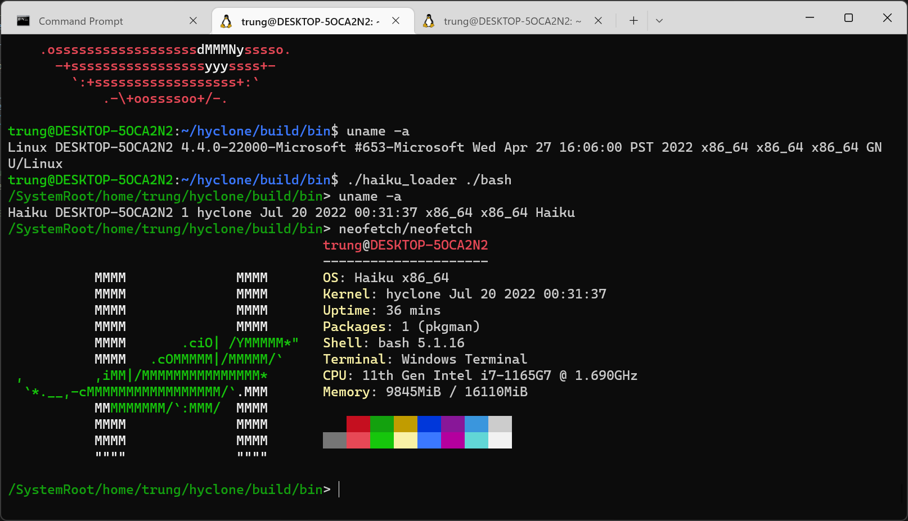

# Hyclone

Hyclone is a runtime environment for [Haiku](https://github.com/haiku/haiku) applications.

Hyclone currently targets and supports Linux, but should be, with some modifications, portable to any ELF-based SysV OSes (including Haiku itself).

Currently, Hyclone only supports x86_64.

## Build instructions

### Building Haiku objects

Hyclone uses precompiled objects from a Haiku build. Therefore, the first step is to fetch a copy of Haiku sources and build it.

On an Ubuntu machine:

```
sudo apt install -y git nasm bc autoconf automake texinfo flex bison gawk build-essential unzip wget zip less zlib1g-dev libzstd-dev xorriso libtool python3

git clone https://review.haiku-os.org/buildtools
git clone https://review.haiku-os.org/haiku

cd haiku
mkdir generated.x86_64; cd generated.x86_64
../configure --cross-tools-source ../../buildtools --build-cross-tools x86_64

jam -q -j8 libroot.so runtime_loader
```

Note that we don't need the full Haiku system, but only `libroot` and `runtime_loader` to build Hyclone. For more information on building Haiku, visit [Haiku's official website](https://www.haiku-os.org/guides/building/).

### Building Hyclone

Start by cloning this repo:

```
# Assuming that you're in the Haiku build root (generated.x86_64)
cd ../..
git clone https://github.com/trungnt2910/hyclone

cd hyclone
mkdir build; cd build
cmake ..
# For test builds, do this to install everything to the build directory:
# cmake .. -DCMAKE_INSTALL_PREFIX=.
sudo make install
```

The Hyclone source directory must be placed in the same directory as Haiku, so that it could detect and copy the required object files.

### Running Hyclone

First, set up our environment a little bit:

```
# Path to modified libroot is usually at $CMAKE_INSTALL_PREFIX/lib
export LIBRARY_PATH=/SystemRoot/path/to/modified/libroot:/boot/system/lib
# This will be prepended to PATH by haiku_loader
export HPATH=/boot/system/bin:/boot/system/non-packaged/bin
export HPREFIX=/path/to/haiku/installation

# Set up a few links:
ln -s /dev $HPREFIX/dev
```

Now, assuming that you're at `$CMAKE_INSTALL_PREFIX`, run:

```
cd bin
./hyclone_server
```

This starts the Hyclone kernel server, a process that manages some system states that should have been handled by the Haiku kernel.

After that, you can run Haiku binaries by:

```
./haiku_loader <binary name> <args>
```

A screenshot of Hyclone on WSL1:




### Notes

- While some basic CLI apps (`bash`, `gcc`,...) may run, most won't work on Hyclone, as this project is still in its early stages.
- The host's root is mounted on Hyclone as `/SystemRoot`. When translating calls from Haiku to the host system, Hyclone maps the Haiku root to `$HPREFIX`, and when translating the results, Hyclone appends `/SystemRoot` to the host's root. 